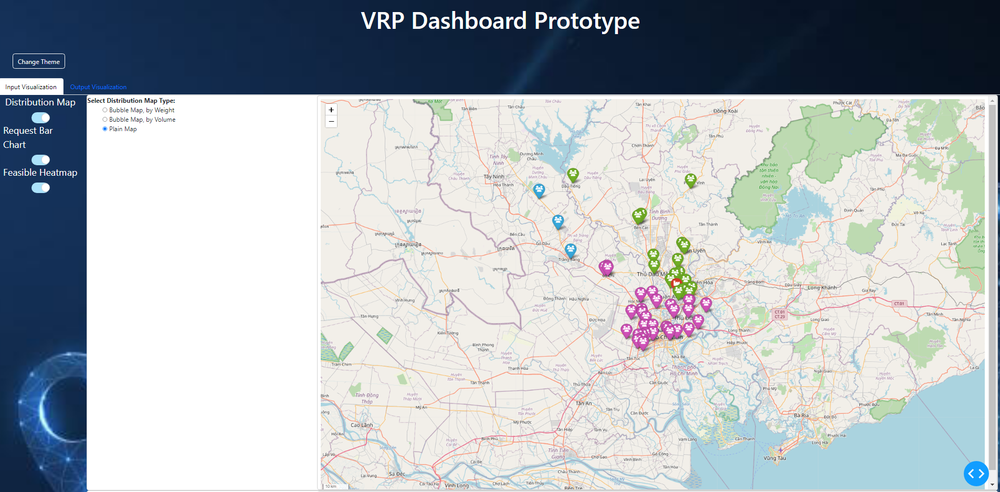
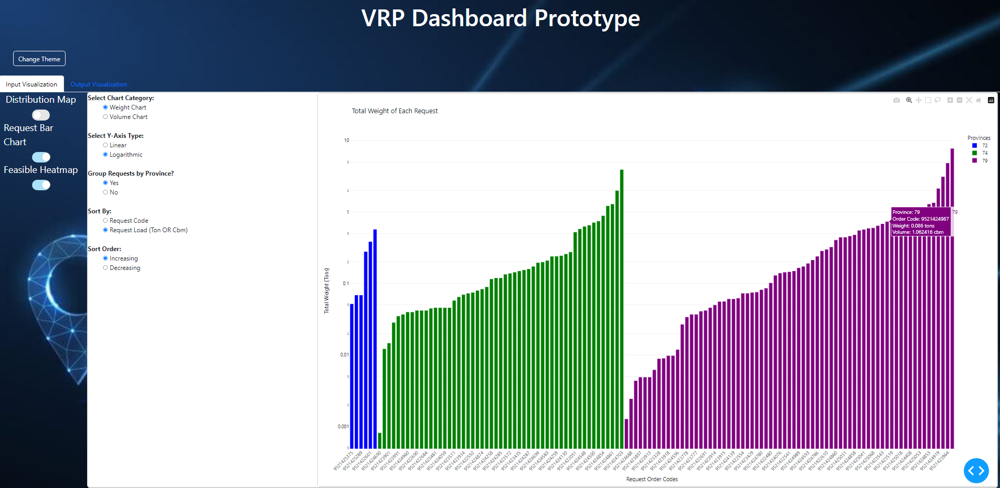
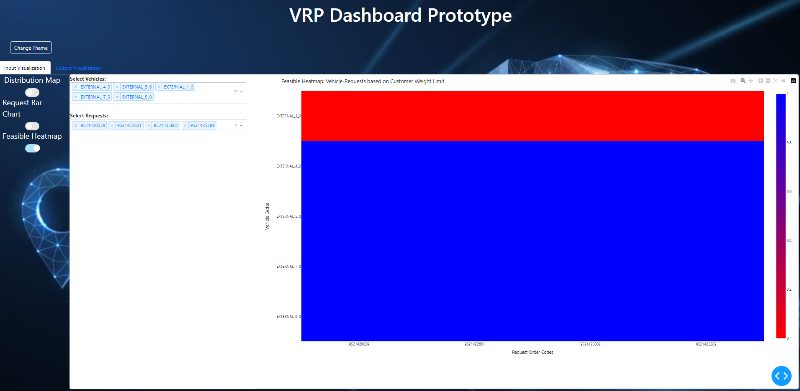
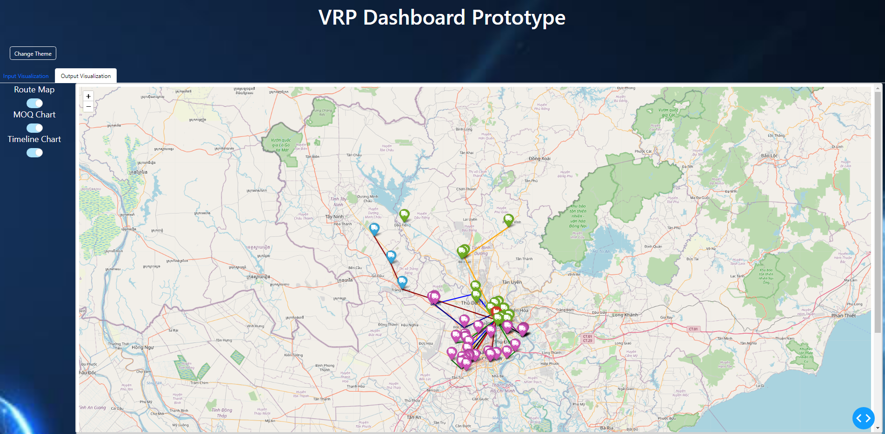
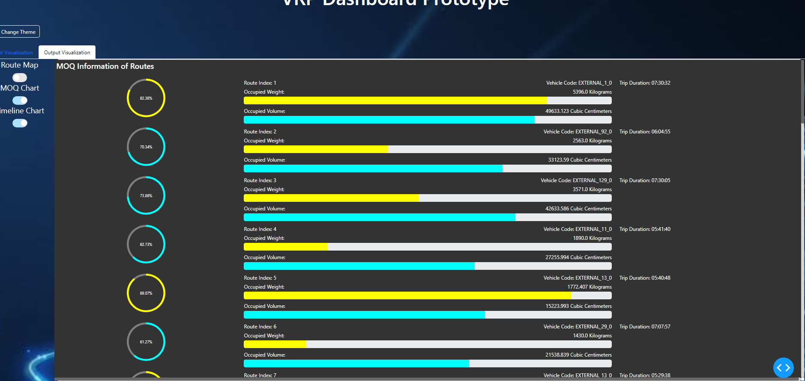
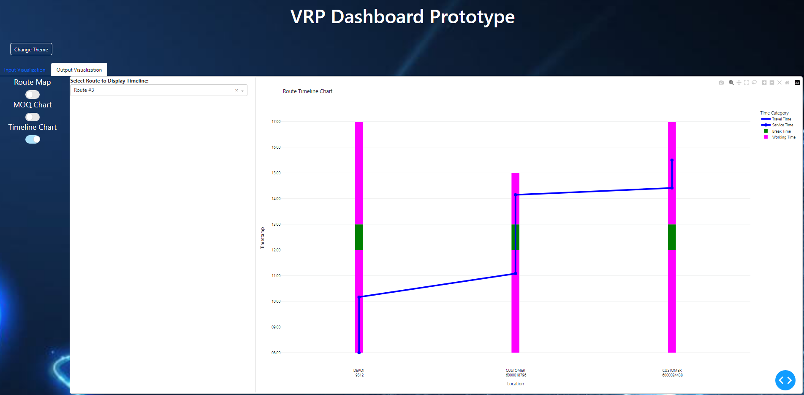

# VRP Dashboard Demo

## Mục Lục
- [Mô Tả](#mô-tả)
- [Giao Diện](#giao-diện)
- [Cấu Trúc Chương Trình](#cấu-trúc-chương-trình)
- [Yêu Cầu Kỹ Thuật](#yêu-cầu-kỹ-thuật)
- [Hướng Dẫn Chạy Chương Trình](#hướng-dẫn-chạy-chương-trình)
- [Định Hướng Dự Án](#định-hướng-dự-án)
- [Thông Tin Liên Hệ](#thông-tin-liên-hệ)

## Mô Tả:
Chương trình tạo ra 1 Dashboard, chứa các biểu đồ mô tả (& trực quan hoá) dữ liệu đầu vào & đầu ra của bài toán phân chuyến vận tải (Vehicle Routing Problem). [Xem mô tả chi tiết ở đây](docs/description.md) 

## Giao Diện

## Cấu Trúc Chương Trình
- [assets](assets): Thư mục chứa các ảnh minh hoạ (được thể hiện trên Dashboard) & File JavaScript định nghĩa tính năng kéo thả
    - [drag-n-drop.js](assets/drag-n-drop.js): File JavaScript định nghĩa tính năng kéo thả (Để thay đổi kết quả phân chuyến)
- [callback_functions](callback_functions): Các hàm Dash callbacks để vận hành chương trình
    - [data_output_update.py](callback_functions/data_output_update.py): Hàm callback để update JSON Output File (Cập nhật kết quả phân chuyến cua bài toán VRP) sau khi đã drag-and-drop
    - [input_visualization_render.py](callback_functions/input_visualization_render.py): Hàm callback để thay đổi chart hiển thị ở Tab "Input Visualization" dựa trên nút bấm
    - [output_visualization_render.py](callback_functions/output_visualization_render.py): Hàm callback để thay đổi chart hiển thị ở Tab "Output Visualization" dựa trên nút bấm
    - [theme_change.py](callback_functions/theme_change.py): Hàm callback để thay đổi phông nền
- [components](components): Các thành phần cấu thành Dashboard / các biểu đồ trong Dashboard
    - [buttons.py](components/buttons.py): Các nút bấm để display ra chart mình mong muốn
    - [drag_and_drop_zone.py](components/drag_and_drop_zone.py): Khu vực kéo-thả các requests giữa các chuyến xe
    - [dropdowns.py](components/dropdowns.py): Các dropdowns để user hiển thị lựa chọn (Trong Feasible Heatmap & Route Timeline Chart)
    - [heatmap_layout.py](components/heatmap_layout.py): Layout của Feasible Heatmap (Thể hiện xe nào được đi giao đơn hàng nào)
    - [route_elements.py](components/route_elements.py): Các điểm của mỗi route 
    - [theme_changer.py](components/theme_changer.py): Điều chỉnh thay đổi phông nền của chương trình
    - [timeline_chart_layout.py](components/timeline_chart_layout.py): Layout của Timeline Chart
- [components_graph](components_graph): Các bảng biểu được trưng bày ở Dashboard 
    - [bar_chart.py](components_graph/bar_chart.py): 2 charts show volume & weight của mỗi request (Đã được cập nhật lại ở nhánh input_visualization_with_control_board để 1 bar chart được điều chỉnh hiển thị khác nhau)
    - [folium_dist_map.py](components_graph/folium_dist_map.py): Map thể hiện phân bố lượng hàng các điểm giao
    - [folium_route_map.py](components_graph/folium_route_map.py): Map thể hiện đường đi giao hàng của từng chuyến giao (Đã được phân chuyến)
    - [heatmap.py](components_graph/heatmap.py): Heatmap thể hiện độ tương thích giữa xe và đơn hàng (dựa trên cấm tải của địa điểm giao hàng)
    - [message_board.py](components_graph/message_board.py): Bảng thông tin các chuyến (In ra từ File JSON thô, để debug)
    - [moq_info_chart.py](components_graph/moq_info_chart.py): Chart thể hiện thông tin MOQ của từng chuyến (Mỗi chuyến được thể hiện bởi 2 progress bars thể hiện tỉ lệ chuyên chở theo Weight & theo Cbm, và 1 donut chart thể hiện tỉ lệ MOQ)
    - [pie_chart.py](components_graph/pie_chart.py): Các pie chart thể hiện thông tin MOQ của từng chuyến (Tập con của MOQ Info Chart)
    - [timeline_chart.py](components_graph/timeline_chart.py): Timeline chart thể hiện thông tin thời gian của từng chuyến (Thông tin về Time Windows của kho & điểm giao trong chuyến cũng như là thời gian xe chạy & service time)
- [css_styles](css_styles): Thư mục chứa các CSS Styles để điều chỉnh hiển thị 
    - [css_styles.py](css_styles/css_styles.py): File chứa các tuỳ chỉnh hiển thị của từng đối tượng trong Dashboard
- [docs](docs): Các file doc mô tả chi tiết & hướng dẫn chạy chương trình
- [images](images): Thư mục chứa các ảnh minh hoạ
- [tabs](tabs): Định nghĩa hiển thị từng Tab
    - [input_visualization.py](tabs/input_visualization.py): Tab "Input Visualization" gồm các bảng biểu khác nhau biểu thị thông tin của file JSON đầu vào (Bài toán VRP)
    - [output_visualization.py](tabs/output_visualization.py): Tab "Output Visualization" gồm các bảng biểu khác nhau biểu thị thông tin của file JSON đầu ra (Bài toán VRP), kèm theo tính năng kéo thả điều chỉnh kết quả đầu ra
- [test](test): Thư mục chứa các chương trình kiểm thử phần mềm (Chưa có update)
- [utilities](utilities): Các hàm xử lý chung của chương trình
    - [data_loader.py](utilities/data_loader.py): Các hàm load file data
    - [display_processing.py](utilities/display_processing.py): Các hàm xử lý phần view (front-end)
    - [input_data_processing.py](utilities/input_data_processing.py): Các hàm xử lý data input
    - [output_data_processing.py](utilities/output_data_processing.py): Các hàm xử lý data output
- [dashboard_app.py](dashboard_app.py): File chạy chương trình (Kiêm tạo layout, gọi callback v.v. - Cần phải refactor triệt để theo hướng HMVC để code không còn bẩn bựa)

## Yêu Cầu Kỹ Thuật
- Python 3.8 trở lên
- Plotly Dash & Dash Bootstrap Components
- Folium
- Plotly GO (Graph Objects)

## Hướng Dẫn Chạy Chương Trình
[Xem hướng dẫn chạy chương trình ở đây](docs/run_app.md)

## Định Hướng Dự Án
Dự án làm nền tảng để sau này merge vào VRP Dashboard chính thức (Được viết theo kiến trúc HMVC và hướng plugin-oriented-programming)  
[Xem chi tiết định hướng dự án ở đây](docs/future_work.md)

## Thông Tin Liên Hệ
Tên Chủ Dự Án: Nguyễn Trần Minh Châu  
Email Liên Hệ: chaunguyen1993vn@gmail.com  
Link Dự Án (Chế độ Private): https://github.com/chaunguyen1993ece/vrp_dashboard_visualization (Nhánh main_product)
